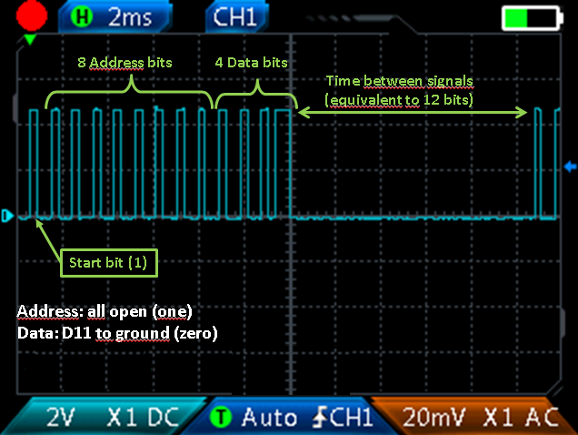
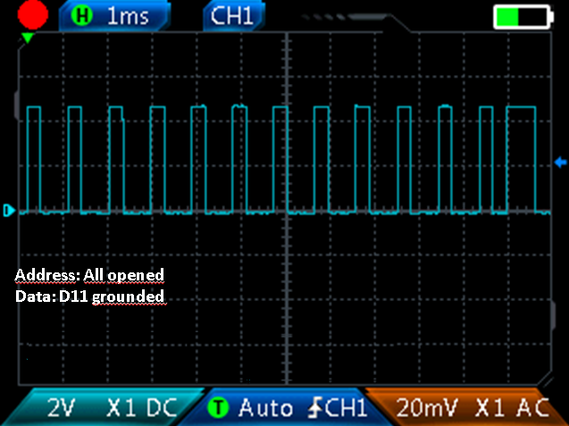

# HT12D emulator for PIC

## Introduction

This project was created from my need to decode signals from sensors already installed in my house. 

Sensors transmit signals using the HT12E encoder and the receiver uses its HT12D pair to decode and process the signals. 

As I intend to redo the receiver circuit, I decided to try removing the HT12D and also a CD4093, replacing them with a single MCU PIC.

 


## HT12E/HT12D Operation

Here, I don't want to exhaust the subject as there are many other websites/blogs that describe the functioning 
of this pair of circuits. 

I will limit myself to some important aspects for understanding the C code.

All information in this secction considers following setup:

a) HT12E: VDD = 5 Volts; fosc = 3kHz (Rosc = 1MOhm); Address pins all opened (address = 11111111)
b) HT12D: VDD = 5 Volts; fosc = 125kHz (Rosc = 68kOhms); Address pins all opened (address = 11111111)


The HT12E sends signals with the following waveform:

 

Each message is compound of 13 bits(1 start bit, 8 address bits and 4 data bits), each bit ocuppies 3 clocks. 
As clock is 1ms, message takes 13ms and time between messages takes 12ms (this time is refered as "pilot period" 
in HT12E datasheet).

A bit is reconized as "1" if signal keeps low for 2 clocks and keeps high for 1 clock.
For a zero bit, the logic is inverse, signal keeps low for 1 clock and high for 2 clocks


 

HT12D receives this signals through pin 14 (DIN) and:

a) Compares signal address with expected address (pins A0 to A7) for three consecutive signals;
b) If addreeses are equal, ativate VT pin and send signal data to pins D8 to D11.


Thus, for emulates HT12D in microcontroller, we need to implement a specific waveform analyzer.

## MCU Selection

Well, actually, I didn't have much of a choice. In my stock I have some 12F675 PICs and only one 16F819 PIC. 

As I find the PIC12F675 very versatile for small applications, I decided to use it to emulate the HT12D.

This MCU has some limitations, but for my application it will be more than enough. For example, it only has six GPIOs .

To emulate the HT12D with PIC12F675, I decided to:

a) Store address into code:
   This has the advantage of the address not being fisically visible on HT12D (connections between address pins and GND). 
   The disadvantage is that we must compile and upload the code to PIC when address needs to be changed;
   
b) Set data in pin (DIN) as GPIO3 (MCLR):
   As I already mentioned, selected PIC has only six GPIOs and we need to use all of them (1 for VT, 1 for DIN and 4 
   for D8 to D11).

   As DIN must be a input pin, makes sense use PIC's GPIO3 for this pin. Leaving other GPIOs for data output.

   This choice implies disabling master clear (MCLR), but it also implies losing microprocessor's sleep mode.
   However, as we will see later, other configurations are possible and we can "restore" sleep mode.
 
c) Implement a interrup on change rotine for detect rising and falling edges:
   As HT12E oscillation frequency relatively low, this approach seems to be appropriate. In addition to edge 
   detection, I implemented a time count with PIC's Timer0.
   
This setup corresponds to "HT12D classical emulation".


## Alternatives

The classical emulation is interesting for projects in which simply replacing a HT12D by a PIC12F675 proves to be 
advantageous. Like, for example:

a) Reduction of PCB complexity:
   HT12D has 18 or 20 pins, needs address jumpers and a resistor for the oscillator.
   PIC has 8 pins and, in this configuration, does not need any external components.
   
b) Protection of address:
   In HT12D the address is visible. In PIC the address is inside code.


The main disadvantage of classical emulation is its energy consumption. 
While HT12D goes into sleep mode when there is no signal present, PIC without this possibility (GPIO3 as DIN) 
consumes close to 500uA constantly! The table below shows source  (Fosc = 125kHz, Vdd = 5V):

|                  |          Source Current (uA)                             |
|-------------------------------------------------------------------------------
| Device           |  Standby/Sleep mode        |  Processing signals          |
| HT12D            |  < 1 | 115|
| PIC12F675        |  500 | 500|


### HT12D Pulsing Output

### HT12D With Sleep Mode

## Operation modes


 

## Performance

This example uses 'excel_to_pandas.py' to encapsulates library functions. 
To access library functions directly, see the code in 'excel_to_pandas.py'.
To a full functional example, see 'example.py'.


```Python
# Including library to our code:
import excel_to_dataframe.excel_to_pandas as etd   

# Test access to library printing version:
print(etd.version())

# Opening an Excel Workbook:
# Function 'open_excel' will return:
# 	 0 	- success;
#   -1 	- file not found or
#   -2 	- file found, but it isn't a Excel valid file.
ret = etd.open_excel(<excel_file_full_path>) 

# Loading data from worksheet:
# Function 'ws_to_df' will return:
# A Pandas dataframe if success or -1 otherwise
my_pandas_dataframe_1 = etd.ws_to_df(<excel_worksheet_name_1>) 
my_pandas_dataframe_2 = etd.ws_to_df(<excel_worksheet_name_2>) 

# Closing an Excel Workbook. This is mandatory to change from an Excel File to another.
etd.close_excel()

```

# Personal site:
http://www.nrbenergia.somee.com/  

or

https://nrbenergia.azurewebsites.net/

# More info:
https://www.linkedin.com/in/nelsonrossibittencourt/
