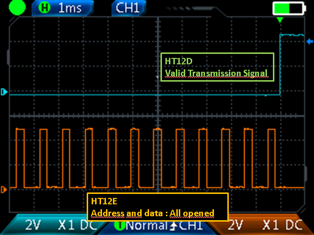
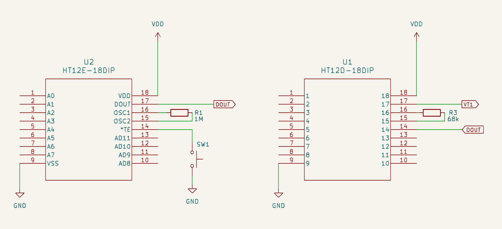
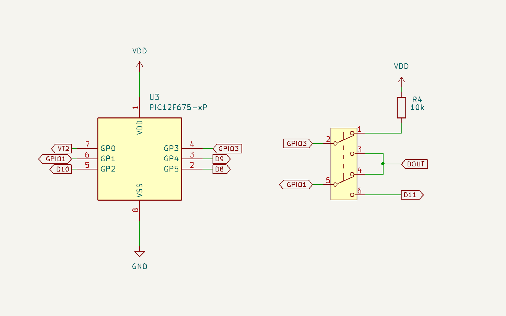
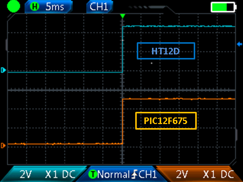
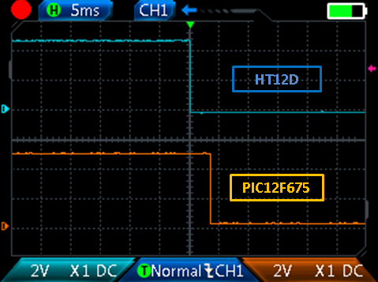
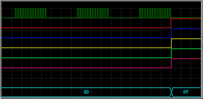

# HT12D emulator for PIC

## Introduction

This project was initiated to decode signals from sensors already installed in my home.
These sensors transmit signals using the HT12E encoder, while the receiver employs the HT12D decoder to process the incoming signals.
To improve the receiver circuit, I plan to eliminate the HT12D and CD4093, replacing them with a single PIC microcontroller.

<br>

## HT12E/HT12D Operation

To avoid redundancy, I'll focus on the key aspects relevant to understanding the C code. For more in-depth information
on the operation of the HT12E and HT12D pair, please refer to their respective datasheets.

Circuit Configuration:

- *HT12E*:
VDD = 5V
fosc = 3kHz (Rosc = 1MΩ)
Address: 11111111 (all address pins open)

- *HT12D*:
VDD = 5V
fosc = 125kHz (Rosc = 68kΩ)
Address: 11111111 (all address pins open)

HT12E Signal Waveform:

<br>
<table align="center"><tr><td> 
<br>
<p align="center" width="100%"><b>Figure 1. HT12E waveform</b></p>
</td></tr></table>
<br>

Each message consists of 13 bits (1 start, 8 address, 4 data), each bit requires 3 clock cycles. 

Since the clock cycle is 333&#956;s (1/3000), a bit will take 1ms (3 x 333&#956;s) and a message 
will take 13ms (13 x 1ms). A 12ms interval, known as the pilot period (HT12E datasheet), separates consecutive messages.

A bit is recognized as a '1' if the signal remains low for two consecutive clock cycles, followed by a high cycle. Conversely, a bit is identified as a '0' if the signal is low for one clock cycle, followed by two high cycles.

Figure 2 illustrates the timing diagram of the message "1111111111110" as observed on the HT12E DOUT pin. 

<br>
<table align="center"><tr><td>
<br>
<p align="center" width="100%"><b>Figure 2. HT12E message "1111111111110"</b></p>
</td></tr></table>
<br>

The HT12D receives the encoded messages through its data input pin (DIN) and:

a) Compares the received address (A0-A7) to the expected address for three consecutive messages and

b) If the received address matches the expected address, the VT pin is activated, and the decoded data bits (D8-D11) are output.

<br>
<table align="center"><tr><td>
<br>
<p align="center" width="100%"><b>Figure 3. HT12D receiving valid message</b></p>
</td></tr></table>
<br>

Emulating HT12D requires a waveform analyzer to accurately measure the timing parameters of 
the input signal, including pulse widths and inter-pulse interval.

<br>

## MCU Selection


Well, I didn't have many options. I only had one PIC16F819 and a few PIC12F675s.

Given the versatility of the PIC12F675 for small-scale applications, I chose it to emulate the HT12D.

Although PIC12F675 has certain limitations, including a limited number of GPIO pins (six), it is 
still well-suited for my specific application requirements.

To implement an HT12D emulator using a PIC12F675, I adopted the following strategies:

a) Store the valid address in program memory:
   The address is embedded within the firmware, eliminating the need for physical address pins. 
   However, any address change necessitates code recompilation and MCU reprogramming.
   
b) Use GPIO3 (MCLR) as the data input pin (DIN):
   As I already mentioned, selected PIC has only six GPIOs and we need to use all of them (1 for VT, 1 for DIN and 4 for D8 to D11).
   As DIN must be a input pin, makes sense use PIC's GPIO3 for this pin. Leaving other GPIOs for data output.Utilizing GPIO3 as input for DIN requires disabling the MCLR function, thereby compromising the device's ability to enter low-power sleep mode.However, we'll explore alternative configurations to re-enable sleep mode later.
 
c) Implement an interrupt-on-change routine to detect edges:
   Considering the relatively low oscillation frequency of the HT12E, an interrupt-driven approach 
   combined with Timer0-based timing measurements seems appropriate.
   

I refer to this configuration as the "classic HT12D emulation."

<br>

## Alternatives to "classic emulation":

Classic emulation is useful when directly replacing an HT12D with a PIC12F675 offers advantages, such as: 


a) Reduced PCB complexity:
   The HT12D typically requires 18-20 pins, address jumpers, and an oscillator resistor.
   In contrast, the PIC12F675 can be configured to require only 8 pins and no external components.
   
b) Enhanced address security:
   The HT12D's address is physically exposed, making it vulnerable to potential tampering.
   With the PIC12F675, the address is embedded within the firmware, providing a higher level of security.

The main disadvantage of classical emulation is its energy consumption. 

While HT12D goes into sleep mode when there is no signal present, PIC without this possibility (GPIO3 as DIN) 
consumes close to 520&#956;A constantly! 

A significant limitation of the classic emulation approach is its relatively high power consumption.
Unlike the HT12D, which enters a low-power sleep mode during idle periods, the PIC, with GPIO3 
configured as the DIN input, remains active, resulting in a continuous current consumption of 
approximately 520 µA.

The table below shows the current consumption at 125 kHz and 5V.

<br>
Table 1. Current comsuption. HT12D x PIC12F675 without sleep mode

| Device     |  Standby/Sleep mode |  Processing signals |
| :--- | :---: | :---: |
| HT12D      | < 1&#956;A  | 115&#956;A |
| PIC12F675  | 520&#956;A  | 520&#956;A |
<br>

Considering this high consumption (relative to HT12D) and that my need is for just three data outputs
(one of them to activate a buzzer), I created two alternatives to the "classical emulation". 
Of course, you can implement both alternatives simultaneously.

Considering the power consumption implications of the classic emulation approach and that 
my application request only three data outputs (one of them for dedicate to driving a buzzer), 
I explored two alternative approaches.

<br>

### Alternative 1: HT12D With Sleep Mode

To utilize the PIC12F675's power-down mode, we must ensure that GPIO3 is held high.
Therefore, the DIN pin must be relocated to GPIO1 (pin 6). This configuration, while enabling 
sleep mode, limits the number of available data bits to three. However, it significantly reduces
power consumption compared to the classic emulation.

Table 2 quantifies the power savings achieved by utilizing the PIC's low-power sleep mode.

<br>
Table 2. Current comsuption. HT12D x PIC12F675 with sleep mode

| Device     |  Standby/Sleep mode |  Processing signals |
| :--- | :---: | :---: |
| HT12D      | <1&#956;A  | 115&#956;A |
| PIC12F675  | <1&#956;A  | 520&#956;A |
<br>

To enable sleep mode, uncomment the following line in the **main.h** file:

```C
#define SLEEP_MODE                              // This mode:
                                                // 1) adds sleep mode in MCU reset and after VT timeout;
                                                // 2) removes D11 data pin (PIC12F675 needs GPIO3 high to sleep mode) and
                                                // 3) changes input (DIN) from GPIO3 to GPIO1.
```

<br>

### Alternative 2: HT12D with Pulsating Output


In my sensors project, the VT signal from the HT12D triggers a latch composed of two NAND gates
 from a CD4093. A third NAND gate functions as an oscillator to drive a buzzer. 
 Given the relatively low memory utilization (less than 30% program memory and 50% data memory) 
 by the HT12D emulation, we have the capacity to implement PWM control for the buzzer.

In current version, I selected PIC's GPIO4 to controls a NPN transistor that activates the buzzer. To activate the
pulsanting output, uncomment the following line in the **main.h** file:

```C
#define BUZZER_D9                               // This mode uses D9 pin as buzzer controller
```

<br>

## Code description and use

The code was written in MPLAB X IDE (v6.20) and compiled using XC8 (v2.5).

To enhance code readability, maintainability, and portability, I modularized the code by dividing it into multiple files:

- [**pic12f675_conf.h**](/src/pic12f675_conf.h) : PIC12F675 configuration word settings;

- [**main.h**](/src/main.h)          : Main configurations, hardware mapping and definitions for HT12E/HT12D signals. This file 
				   uses pic12f675_conf.h;
				   
- [**main.c**](/src/main.c)            : Main C routine. When porting the code to different microcontrollers, you may need to modify the register settings within the main function to accommodate specific hardware configurations.

<br>

### Setting operation mode

Comment/Uncomment defines in main.h:

| Operation Mode | BUZZER_D9 | SLEEP_MODE| PINs |
|---| --- | --- | --- |
| Classical | Commented | Commented | 1 DIN, 1 VT and 4 data outputs |
| Sleep mode | Commented | Uncommented | 1 DIN, 1 VT and 3 data outputs |
| Pulsating output | Uncommented | Commented | 1 DIN, 1 VT and 4 data outputs (3 for HT12E decoded data and 1 for PWM) |
| Sleep mode + Pulsating output | Uncommented | Uncommented | 1 DIN, 1 VT and 3 data outputs (2 for HT12E decoded data and 1 for PWM) |

<br>

### Hardware mapping

Code in **main.h** is self-explanatory:

```C
#define PORT              GPIO                  // Nickname for input/output PORT (PIC12F675 has only one) 

// * DIN pin *
#ifdef SLEEP_MODE
    #define DIN           (1<<1)                // DIN pin with sleep mode enabled
#else
    #define DIN           (1<<3)                // DIN pin with sleep mode disabled
#endif

#define VT                (1<<0)                // Valid Transmission pin               
   
// * Data pins *
#define D8                (1<<5)                // D8 data (MSB)
#define D9                (1<<4)                // D9 data or buzzer
#define D10               (1<<2)                // D10 data or LSB in SLEEP mode version

// * LSB data pin
#ifndef SLEEP_MODE
    #define D11           (1<<1)                // D11 data or MCLR pulled-up for sleep mode
#endif

#define TRIS_CONF         0xFF & DIN            // Data PINs (warning PIC12F675's GPIO3 is only input, never output)
```


To enhance code readability and portability, the unique port of the PIC12F675 is mapped to the **PORT** macro (`#define PORT GPIO`).
For different microcontroller architectures, the port mapping should be adjusted to optimize 
pin assignments and PCB layout

<br>

### HT12E parameters:

Specify the configuration parameters for the encoder, which can be either an HT12E or an emulator:

```C
#define HT12E_Fosc    3000                      // HT12E oscillation frequency (Hz)
#define time_tol      5                         // Time tolerance (%)
```

These values will define the timing thresholds for bit-level synchronization and decoding.
**Warning** :  _HT12E_Fosc_ must be > 2000 Hz. This allows using 8 bits unsigned integers (_uint8_t_) in code. 
If frequencies lower than 2kHz are mandatory for your project, it will be necessary to redeclare some 
variables as _uint16_t_.

<br>


### MCU as HT12D parameters:

Finally, we define address that MCU will consider valid (compared to "transmitter" address) and a
"receiver" frequency. This frequency will only be used to calculate VT's time out (2<sup>14</sup> * clocks).

```C
#define HT12D_Address   0xFF                    // Expected address code 
#define HT12D_FOSC      125                     // Oscillation frequency (MHz)
```

<br>

## Timing parameters:

In this project, I used PIC12F675's internal oscillator (i.e., 4MHz clock -> 1MHz instruction cycle) and 
configured _timer0_ (8 bits timer) to achieve an overflow every 1.024 ms.  

This time base was used in the following definitions (all in **main.h**):

<br>

### Instruction cycle uses:
```C
#define period        (1e6/HT12E_Fosc) 	// Oscillation period (us)
```
<br>

### Overflow and timer size:
```C
#define min_time (256 * period)/1024 	// "Minimum" valid time 
```

```C
#define VT_TIMEOUT (int)(16348/(HT12D_FOSC*1.024))
```
<br>

Using another MCU, you will probably need to change these parameters to obtain correct 
timing values. Additionally, parameters such as pre-scaler, internal comparators, clock source and other 
port mappings may be necessary. 

Porting the code to different microcontroller platforms may require adjustments to the timer
configuration parameters, including the prescaler, internal comparators, and clock source. 
Additionally, the pin mapping scheme should be adapted to the specific device's GPIO configuration.
In this case, changes must be made in **main.h** and **main.c** files.


<br>

## Testing setup


To validate the functionality of the HT12D emulation, I build the circuit shown in Figures 4a and 4b.

The HT12E generates a signal similar to that shown in Figure 3 (orange). 
This signal (DOUT) goes to HT12D (pin 14) and PIC12F675 (pin 4 or 6, depending on the desired 
configuration/alternative).

<br>
<table align="center"><tr><td>
<br>
<p align="center" width="100%"><b>Figure 4a. HT12E and HT12D</b></p>
</td></tr></table>
<br>


A double-pole, double-throw (DPDT) switch is employed to switch between the classic emulation (terminals 1-2 and 4-5 closed) mode 
and the sleep mode alternative (terminals 2-3 and 5-6 closed). The PWM mode for the buzzer can be activated regardless of the switch
position.


<br>
<table align="center"><tr><td>
<br>
<p align="center" width="100%"><b>Figure 4b. PIC12F675 - All alternatives</b></p>
</td></tr></table>
<br>

Figures 5a and 5b illustrate the VT signal waveforms for the original HT12D (VT1) and the PIC12F675-based emulation (VT2).


<br>
<table align="center"><tr><td>
<br>
<p align="center" width="100%"><b>Figure 5a. HT12D and PIC12F675 VT signals, rising edge</b></p>
</td></tr></table>
<br>


The VT1 and VT2 signals exhibit similar rising edge characteristics. 
However, the falling edge of the emulated VT2 signal is delayed by approximately 5 milliseconds 
compared to the original VT1 signal. This timing difference can be mitigated by calibrating 
the _VT_TIMEOUT_ parameter in the code. This adjustment should not compromise the overall 
functionality of the circuit.


<br>
<table align="center"><tr><td>
<p align="center" width="100%"><br>
<b>Figure 5b. HT12D and PIC12F675 VT signals, falling edge</b></p>
</td></tr></table>
<br>

Using a logic analyzer, "classic emulation" looks like (address 11111111, data 1111, horizontal scale 4ms/div):

<br>
<table align="center"><tr><td>
<p align="center" width="100%"><br>
<b>Figure 6. PIC emulation HT12D - Logic analyzer</b></p>
</td></tr></table>
<br>

<br>

## Pre-compiled hex files:


The files below were with XC8 (v2.5) through the MPLAB X IDE (v6.20):

| Configuration | File (.hex) | Size (kb) | Hash (SHA256)|
| --- | ---| --- | --- |
| Classic emulation | [ht12d_emu_classic](/precompiled/ht12d_emu_classic.hex)	|   1.75           |C6248A0212A823E3D57A45783A505D1981C59C3F63641A3C3587966E23EC69D4 |
|Sleep Mode| [ht12d_emu_sleep](/precompiled/ht12d_emu_sleep.hex)|               1.74       |E9ADBB9543C5243E1B94B981915072BA44A5773D71C1AEE5CBEE4E82D3432259 |
|Buzzer in GPIO4| [ht12d_emu_buzzer](/precompiled/ht12d_emu_buzzer.hex)|         1.79           |DB18A0335E7B150368849380EC1F9C34F4EF489A816BF67B98417C485D4EA027 |
|Sleep Mode + Buzzer in GPIO4| [ht12d_emu_sleep_buzzer](/precompiled/ht12d_emu_sleep_buzzer.hex)| 1.78 |893904A96FA3832574CBD0AFD2131F438C26D219F2CD9DDEC31379ABD038DE9B |
<br>

## Going further

Here are a few ideas for projects based on this starting point:

- Utilize a pair of PIC microcontrollers to implement dedicated encoder and decoder functionalities;

- Customize the protocol by modifying data format, bit length, and addressing schemes;

- Adapt the algorithm for more resourcing or multitasking microcontrollers;

- Employ a two-wire serial communication protocol to transmit the output data value serially.
<br>

## Personal site:
http://www.nrbenergia.somee.com/  

or

https://nrbenergia.azurewebsites.net/

<br>

## More info:
https://www.linkedin.com/in/nelsonrossibittencourt/
